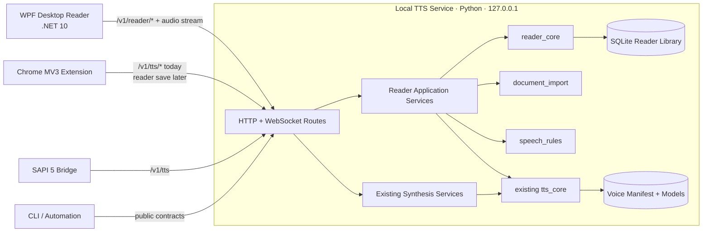
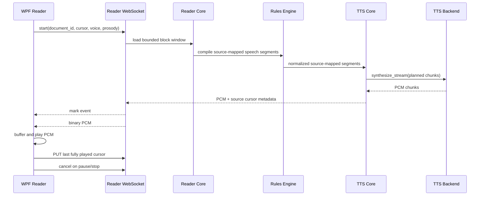

# TTS Platform Reader

## Post-v1 design and Codex execution specification

| Field | Value |
|---|---|
| Status | Active post-v1 design |
| Design version | 1.1 |
| Design date | 2026-07-19 |
| Last amended | 2026-07-27 |
| Repository | `Kajsing/TTS-platform` |
| Baseline reviewed | `f4648b90069ff22f1773b795a5731b47bb493a63` |
| Intended repository path | `design_doc/reader_workstation_design_v1.md` |
| Working product name | **TTS Platform Reader** |
| Primary target | Windows desktop |
| Primary implementation languages | Python, C#, JavaScript, existing C++ SAPI bridge |
| Next Codex action | **Milestone 3 only** |

> **Codex directive**
>
> This document defines the active post-v1 product track. Do not attempt to
> implement the whole document in one run. First read `AGENTS.md`,
> `docs/codex/Prompt.md`, `docs/codex/Plan.md`,
> `docs/codex/Implement.md`, and `docs/codex/Documentation.md`.
> Milestones 0 through 2 are complete. Execute the next incomplete Reader milestone recorded
> in `docs/codex/Plan.md`, then stop after its validation, documentation update,
> commit, and push.
>
> Existing v1 behavior is a protected baseline, not disposable scaffolding.
> Add the reader workstation without regressing the stable TTS service, Chrome
> reader, model-management flow, Windows bootstrap, release gates, or SAPI
> bridge.

> **Design amendment 2026-07-27**
>
> Editable text, persistent undo/redo, stable block-based cursors, and the
> repeated clipboard-append workflow are first-class product requirements.
> Reader data defaults to the current Windows user's local application data.
> TextAloud dictionary migration and OCR are not 1.0 gates. Future multi-device
> sharing must use additive service APIs rather than synchronizing SQLite files.

---

## 1. Executive decision

Expand the existing TTS platform into a local, privacy-first reading workstation
that can replace the practical workflows people still use TextAloud for.

Do **not** rewrite the existing Python service in .NET. Do **not** turn the
desktop application into a second TTS engine. The current service remains the
single synthesis authority and continues to expose the stable `/v1/tts`,
job, voice, health, and WebSocket contracts.

The new product consists of four additive layers:

1. A persistent reader domain and SQLite-backed document library in Python.
2. A structured document-import and speech-rule pipeline in Python.
3. Additive, token-protected `/v1/reader/*` HTTP and WebSocket contracts.
4. A Windows-native WPF desktop client that consumes those contracts.

The Chrome extension remains a browser client. The SAPI bridge remains a
compatibility client. Both reuse the same local service and installed voices.

The first useful release is not defined as “a window that can speak text.”
It is defined as a reader that can:

- keep an article library and queue;
- import useful document formats;
- play long documents with reliable pause, stop, resume, and highlighting;
- read clipboard content and selected text through explicit Windows hotkeys;
- apply user-controlled pronunciation and transformation rules;
- preserve bookmarks and reading position;
- run offline after models are installed;
- export at least WAV audio;
- back up its library and settings without exposing tokens or private text in
  logs.

---

## 2. Baseline: what already exists and must be reused

The repository already contains a substantial product foundation:

| Existing asset | Disposition in this design |
|---|---|
| `packages/tts_core/` | Keep as the synthesis domain. Extend only through backend-agnostic contracts. |
| `apps/tts_service/` | Keep as the single localhost service. Add reader routes and application services without breaking existing contracts. |
| Existing `/v1/tts`, jobs, voices, health, and `WS /v1/tts/stream` | Preserve. Add new reader contracts rather than changing their meaning. |
| Text normalization, sentence segmentation, and chunk planning | Reuse after adding a structure-preserving layer and source-span mapping. |
| Voice registry and model manifest | Reuse as the source of truth for voice selection and capabilities. |
| Model catalog/install/activate/remove flow | Reuse. Surface it in the desktop onboarding and voice-management UI later. |
| Chrome MV3 extension | Keep as the supported browser reader. Extend it later with “Save to library.” |
| Native SAPI bridge | Keep as an optional compatibility layer for TextAloud and other SAPI applications. |
| Windows setup, Task Scheduler flow, bundle, and release checks | Extend. Do not replace during early milestones. |
| `Kajsing/Chrome-TTS-plugin` | Treat as a historical prototype. Selectively transplant DOM range/highlight algorithms or tests only; do not restore its direct Piper-in-extension architecture. |

The existing code already follows several principles that this track must
preserve:

- backend-agnostic public contracts;
- deterministic domain logic;
- localhost-only defaults;
- token auth and origin control;
- no model artifacts or local tokens committed to Git;
- Windows as the deployment target, even when Codex works through WSL;
- small, validated, reviewable commits.

---

## 3. Product vision

### 3.1 Product statement

**TTS Platform Reader is a Windows-first, offline-first reading workstation for
people who use text-to-speech as a daily tool rather than as an occasional
browser feature.**

Its differentiation is not merely neural voices. Its value is the combination
of:

- capture from Windows and browsers;
- a durable library and queue;
- structured import;
- user-owned pronunciation and transformation rules;
- long-form playback and resume;
- provider-independent voices;
- local privacy;
- audio export and automation.

### 3.2 Primary user journeys

#### Read something immediately

1. The user copies text or selects text in another application.
2. The user invokes a global hotkey.
3. A compact controller appears and playback starts through the local service.
4. The user can pause, resume, stop, change speed, or save the text to the
   library.

#### Import and read a long document

1. The user drags an EPUB, DOCX, HTML, Markdown, or text file into the app.
2. The app shows a structure-aware import preview and warnings.
3. The document is stored as sections and blocks.
4. Playback begins from the selected section.
5. The current source span is highlighted.
6. Closing and reopening the app resumes at the last fully heard position.

#### Correct recurring speech problems

1. The user opens the rules editor from a mispronounced passage.
2. The editor pre-fills the source text and selected voice/language.
3. The user creates a literal, regex, skip, spell, pause, or pronunciation rule.
4. A preview shows original text, spoken text, matched rule, and source mapping.
5. The rule is saved into a scoped rule set and affects future playback.

#### Build one document from selected excerpts

1. The user selects useful text in another application and presses `Ctrl+C`.
2. Clipboard prompt mode notices the explicit copy and asks whether to append to
   the open editable document, create a new document, read now, or ignore it.
3. Appending adds a deliberate paragraph boundary and one atomic undo entry.
4. The user moves to the next page or post and repeats without importing the
   surrounding navigation, signatures, or filler text.

### 3.3 Product principles

1. **Local by default.** Documents and speech rules remain on the machine unless
   a future cloud feature is explicitly enabled.
2. **Platform before model.** No UI or reader contract is tied to a specific
   TTS backend.
3. **Structure matters.** A document is not a giant string.
4. **The heard position is authoritative.** Resume tracks audio actually played,
   not audio merely generated.
5. **Automation must be inspectable.** Rules, imports, and queue behavior must
   have previews, warnings, and reversible actions.
6. **Accessibility is architecture.** Keyboard use, UI Automation, scaling, and
   high contrast are not final polish.
7. **No silent data loss.** Unsupported imports and migration fields produce
   warnings or disabled preserved records, not quiet omission.
8. **Security remains part of the product.** A localhost API containing private
   documents is still an API and must be protected accordingly.

---

## 4. Goals, non-goals, and release boundaries

### 4.1 Goals

The Reader Workstation track must deliver:

- a persistent local document library;
- durable reading positions, bookmarks, queue items, and user rules;
- structured text blocks with source-span mapping;
- additive reader API contracts;
- a Windows-native desktop application;
- long-document streaming playback with highlighting and resume;
- explicit clipboard and selected-text capture;
- direct editing of plain-text documents with durable undo/redo;
- import for TXT, Markdown, HTML, DOCX, and EPUB before MVP completion;
- pronunciation/transformation rule editing and preview;
- open rule interchange that is independent of TextAloud or a specific engine;
- WAV export before beta;
- PDF text extraction before the 1.0 release candidate;
- backup, restore, support-bundle, accessibility, and security gates before 1.0.

### 4.2 Non-goals for this track

The following are deliberately out of scope unless a later explicit decision
changes them:

- replacing the existing TTS service with a C# engine;
- changing existing `/v1/tts` semantics merely to simplify the desktop client;
- cross-platform desktop UI parity;
- cloud-first document storage or synchronization;
- collaborative libraries or multi-user server mode;
- voice cloning;
- a marketplace;
- full SSML parity;
- pixel-for-pixel or wording-for-wording cloning of TextAloud;
- decompiling proprietary TextAloud code or parsing private binary formats
  without a documented, lawful export path;
- committing downloaded voice models, user documents, local databases, tokens,
  registry exports, or generated audio;
- a rich word processor capable of lossless editing of every imported format;
- automatically monitoring and transmitting every clipboard change.
- TextAloud-specific dictionary migration in the MVP;
- OCR as a 1.0 release gate;
- synchronizing or copying the live SQLite database between computers.

### 4.3 Release boundaries

| Release point | Required milestone |
|---|---|
| Developer preview | Milestone 4 |
| Alpha | Milestone 6 |
| MVP | Milestone 7 |
| Beta | Milestone 8 |
| Release candidate | Milestone 11 |

MVP is intentionally later than first playback. The rule engine is part of MVP
because it is one of the capabilities that distinguishes a workstation from a
generic TTS demo.

---

## 5. Locked architectural decisions

These decisions are normative for Codex unless a blocking technical discovery
is documented in `docs/codex/Documentation.md` and a replacement decision is
added to `DECISIONS.md`.

### ADR-R1: Preserve the current TTS platform

The existing Python synthesis service, backend interface, voice registry,
manifest, model-management flow, and public TTS contracts remain in place.

**Reason:** They are implemented, tested, security-reviewed, and already used by
the Chrome and SAPI clients.

### ADR-R2: Use WPF on .NET 10 for the desktop client

Create the Windows desktop client with C#, XAML, WPF, and
`net10.0-windows`.

Use .NET 10 because it is the active LTS baseline at this design freeze. Use
WPF because the product needs mature Windows integration, keyboard behavior,
system tray support, global hotkeys, clipboard messages, accessibility through
UI Automation, and predictable long-term desktop behavior.

Do not start this track in MAUI, Electron, Tauri, WinUI 3, or a Python GUI
framework.

### ADR-R3: Keep the desktop client thin

The desktop application owns presentation, Windows integration, local audio
playback, and client settings. It does not own the canonical document database,
speech rules, or synthesis pipeline.

**Reason:** The Chrome extension, future automation tools, and the desktop app
should share the same reader domain rather than each creating private
implementations.

### ADR-R4: The Python service owns SQLite persistence

Create a new `reader_core` package with repository protocols and a standard
library `sqlite3` implementation.

Do not introduce an ORM in the first reader milestones.

**Reason:** Explicit SQL, migrations, transactions, and dataclasses match the
existing domain style and keep dependencies and generated behavior small.

### ADR-R5: Store structured blocks, not only raw document blobs

Persist sections and ordered blocks. Keep original source text per block and
metadata needed for source mapping.

Do not normalize all line breaks into one string before document structure has
been captured.

### ADR-R6: Add protected `/v1/reader/*` contracts

All reader endpoints, including reads, require the existing bearer token. Add a
reader-specific WebSocket stream rather than overloading the existing raw-text
stream with document-library semantics.

Existing TTS endpoints remain stable.

### ADR-R7: Reuse `tts_core` after compiling a reader speech plan

The reader pipeline produces source-mapped speech segments. Those segments are
then passed through the existing language normalization, sentence segmentation,
chunk planning, and backend synthesis path.

Backend-specific logic remains below the backend interface.

### ADR-R8: Pause by cancelling and resuming from the last played cursor

The first desktop playback implementation does not require server-side suspended
jobs. Pause stops local output, cancels the active reader stream, and preserves
the last fully played cursor. Resume creates a new stream from that cursor.

**Reason:** This gives deterministic semantics with the existing cancellation
model and avoids buffering minutes of unheard audio.

### ADR-R9: Use NAudio stable 2.x behind an interface

Use the stable NAudio 2.x channel for Windows PCM playback and audio device
integration. At this design freeze, NAudio 3 is prerelease and must not be used
without a later ADR.

Wrap NAudio behind `IAudioOutput`; view models must not depend directly on
NAudio types.

### ADR-R10: No raw private content in logs

Logs and metrics may contain document IDs, block ordinals, sizes, durations,
rule IDs, format names, and error categories. They must not contain document
text, titles, clipboard contents, file contents, bearer tokens, or full external
paths.

### ADR-R11: Document import is offline and non-fetching

HTML and EPUB import must not fetch remote stylesheets, scripts, images, fonts,
or linked content. External relationships in DOCX are ignored. PDF import does
not resolve remote resources.

### ADR-R12: Portable bundle before unified signed installer

Early milestones extend the existing Windows bundle and setup scripts. A single
signed installer is release work, not a prerequisite for building the reader.

Do not block domain and UX work on final installer technology.

### ADR-R13: Editable documents use revisioned operations

Plain-text, clipboard, and selection documents are directly editable. Content
changes are stored as bounded operations with persistent undo/redo, stable block
IDs, content revisions, and integer optimistic-concurrency tokens.

Active playback holds a content lease. Editing is rejected until the stream is
cancelled so generated audio, highlighting, and source cursors cannot silently
refer to different text.

### ADR-R14: Use a per-user Reader home and keep sync behind APIs

Installed Windows operation defaults Reader data to
`%LOCALAPPDATA%\TTSPlatform\Reader`. Development and tests use explicit paths.
Globally unique IDs and content revisions preserve a future path to
multi-computer sharing, but sync is not implemented in this track and must never
copy or merge the live SQLite file.

### ADR-R15: Clipboard append is a primary capture workflow

Clipboard prompt mode supports repeated explicit `Ctrl+C` capture into one open
editable document. Each append is atomic and undoable. This workflow is a core
Milestone 5 acceptance path, not incidental clipboard polish.

### ADR-R16: Keep 1.0 independent of TextAloud and OCR

The speech-rule MVP uses an open Reader-owned interchange format rather than a
TextAloud migration contract. Text-layer PDF remains planned for 1.0; OCR is a
post-1.0 optional provider unless a later explicit product decision restores it.

### ADR-R17: Preserve a public-distribution path

The repository may be shared publicly. New dependencies must have recorded,
distribution-compatible licenses, and copied code must preserve notices. Choose
and record the repository license before publishing a desktop binary. The .NET
test stack uses xUnit unless a later ADR records a concrete blocker.

---

## 6. Target architecture



### 6.1 Request-to-audio flow



### 6.2 Layer ownership

| Layer | Owns | Must not own |
|---|---|---|
| WPF presentation | Views, view models, focus, commands, visual state | SQL, document parsing, backend inference |
| Desktop infrastructure | HTTP/WS client, PCM playback, Win32 clipboard/hotkeys, local settings | Reader business rules |
| Reader API | Authentication, validation, DTO mapping, HTTP/WS lifecycle | SQL details, WPF behavior |
| Reader application | Use-case orchestration, transactions, import jobs, playback plan coordination | FastAPI objects |
| Reader domain | Documents, cursors, queues, rules, source maps, repository protocols | SQLite, HTTP, WPF |
| Infrastructure | SQLite repositories, import parser implementations, filesystem, encoder adapters | API policy |
| TTS core | Normalization, segmentation, chunk planning, backend-neutral synthesis contracts | Reader library UI |
| Backends | Model/runtime-specific synthesis | Public reader or API models |

---

## 7. Proposed repository layout

```text
apps/
  chrome_extension/                    # Existing supported browser client
  desktop_reader/
    TtsPlatform.Reader.sln
    Directory.Build.props
    src/
      TtsPlatform.Reader.App/          # WPF/XAML, composition root
      TtsPlatform.Reader.Client/       # HTTP/WS DTOs and service client
      TtsPlatform.Reader.Application/  # View models and client-side use cases
      TtsPlatform.Reader.Windows/      # NAudio, clipboard, hotkeys, tray, DPAPI
    tests/
      TtsPlatform.Reader.Client.Tests/
      TtsPlatform.Reader.Application.Tests/
      TtsPlatform.Reader.Windows.Tests/
  sapi_bridge/                         # Existing optional compatibility client
  tts_service/
    src/tts_service/
      routes/
        tts.py                         # Optional gradual extraction from main.py
        reader.py
        reader_stream.py
      reader_application/
        documents.py
        playback.py
        imports.py
        rules.py
        exports.py

packages/
  tts_core/                            # Existing synthesis domain
  reader_core/
    src/reader_core/
      models.py
      cursors.py
      repositories.py
      services.py
      errors.py
      migrations/
        001_reader_library.sql
        002_rules_and_profiles.sql
        003_search_and_exports.sql
      sqlite/
        connection.py
        repositories.py
        migrations.py
  document_import/
    src/document_import/
      base.py
      plain_text.py
      html.py
      markdown.py
      docx.py
      epub.py
      pdf.py
      ocr.py
      security.py
  speech_rules/
    src/speech_rules/
      models.py
      compiler.py
      evaluator.py
      source_map.py
      preview.py
      interchange.py

contracts/
  reader/
    capabilities.json
    document_summary.json
    reader_stream_started.json
    reader_stream_mark.json
    reader_error.json

design_doc/
  reader_workstation_design_v1.md

docs/
  reader/
    architecture.md
    api.md
    imports.md
    rules.md
    desktop.md
    backup_restore.md

scripts/
  check_reader_contracts.py
  check_desktop_reader.py
  check_reader_release.py
  package_desktop_reader.py
  package_reader_bundle.py
```

Do not create every empty file at once. Milestone 0 creates only the minimum
skeleton and workflow references. Each later milestone adds the files it
actually uses.

---

## 8. Reader domain model

All domain models use standard-library dataclasses. IDs are UUID strings.
Timestamps are UTC. Ordinals are zero-based integers unless an API field
explicitly states otherwise.

### 8.1 Core entities

#### `ReaderDocument`

```text
id
title
source_type
source_name
source_uri              # optional; never logged
source_sha256
language_hint
state                   # inbox | active | finished | archived
created_at
updated_at
imported_at
deleted_at              # soft delete
content_revision        # increments when blocks or source text change
row_version             # optimistic concurrency token
total_sections
total_blocks
total_characters
metadata
```

`source_type` initial values:

- `plain_text`
- `clipboard`
- `selection`
- `text_file`
- `markdown`
- `html`
- `docx`
- `epub`
- `pdf`
- `browser`
- `migration`

#### `ReaderSection`

```text
id
document_id
parent_section_id
ordinal
level
heading
first_block_ordinal
metadata
```

Sections may be nested logically, but blocks remain globally ordered within a
document.

#### `ReaderBlock`

```text
id
document_id
section_id
ordinal
kind
text
character_count
content_sha256
row_version
metadata
```

Initial block kinds:

- `title`
- `heading`
- `paragraph`
- `list_item`
- `quote`
- `table_row`
- `code`
- `separator`
- `note`

Unknown semantic elements are converted to `paragraph` with a warning rather
than discarded.

#### `ReaderCursor`

```text
document_id
block_id
block_ordinal
character_offset
content_revision
segment_index           # optional diagnostic/resume hint
```

The stable anchor is `document_id + block_id + character_offset`.
`block_ordinal` is a traversal and display hint, not identity.
`content_revision` detects anchors created against older content. The service
remaps an older anchor through recorded edit operations when possible and
returns a typed stale-cursor conflict when it cannot do so safely.
`segment_index` is a generated-plan hint and must not be the only resume field,
because rule or pipeline changes can invalidate segment numbering.

#### `DocumentEdit`

```text
id
document_id
base_content_revision
result_content_revision
block_id
start_offset
end_offset
original_text
replacement_text
operation_type          # replace | append | split | merge
created_at
undone_at
```

Editable plain-text changes are recorded transactionally as bounded operations.
Each operation contains enough information for persistent undo/redo and cursor
remapping. Clipboard append is one operation, so one Undo removes the complete
append. History retention is bounded by configurable operation and byte limits;
trimming history never changes current document content.

#### `PlaybackPosition`

```text
document_id
cursor
voice_profile_id
pipeline_version
rules_version
updated_at
completed
```

The desktop client updates this only after a chunk has been fully played.

#### `Bookmark`

```text
id
document_id
cursor
label
note
created_at
updated_at
```

#### `QueueItem`

```text
id
document_id
ordinal
status                  # queued | playing | completed | skipped
added_at
updated_at
```

Only one item may have `playing` status. Queue mutations are transactional.

#### `VoiceProfile`

```text
id
name
voice_id
language_hint
rate
volume
pitch
sentence_pause_ms
comma_pause_ms
rule_set_ids
created_at
updated_at
```

If `voice_id` disappears from the manifest, the profile remains intact but is
reported as unavailable. The service does not silently substitute a voice
without returning a warning.

### 8.2 Speech-plan entities

#### `SourceSpan`

```text
block_id
block_ordinal
start_offset
end_offset
```

Offsets are Unicode code-point offsets in Python and must be serialized and
interpreted consistently by the C# client. Contract tests must cover non-ASCII
Danish text, combining characters, emoji, and surrogate pairs. The API must
state whether serialized offsets are Unicode scalar offsets or UTF-16 offsets.

**Locked contract choice:** serialize source offsets as UTF-16 code-unit offsets
because WPF text APIs and JavaScript DOM ranges both operate naturally in UTF-16.
Python must convert explicitly at the API boundary. Internally Python may keep
native string indices.

#### `SpeechFragment`

```text
spoken_text
source_spans
language_hint
voice_hint
pause_before_ms
pause_after_ms
annotations
```

#### `SpeechSegment`

```text
index
spoken_text
source_spans
cursor_start
cursor_end
language_hint
voice_id
prosody
pause_after_ms
```

Every audible segment must map back to at least one source span unless it is a
synthetic pause or sound cue. A replacement rule maps its replacement to the
original matched span.

---

## 9. SQLite persistence design

### 9.1 Database ownership and path

The service owns the reader database. The first implementation adds:

```toml
[reader]
enabled = true
home_path = ""            # Windows default: %LOCALAPPDATA%\TTSPlatform\Reader
database_path = "reader.db"
managed_files_path = "library"
copy_imported_files = false
```

When `home_path` is empty, installed Windows operation uses
`%LOCALAPPDATA%\TTSPlatform\Reader`. Relative Reader paths resolve under that
home. Development and tests provide explicit repository or temporary paths.
An explicit home override may support a portable layout later, but portable mode
is not a Milestone 1 requirement. Do not migrate existing token, model, or
config paths as part of Reader work.

Future multi-device sharing must operate through versioned service contracts and
globally unique entity IDs. Do not synchronize, copy, or merge a live SQLite
file between computers. No sync transport or cloud dependency is added in the
current track.

### 9.2 Connection policy

Every SQLite connection must enable:

```sql
PRAGMA foreign_keys = ON;
PRAGMA journal_mode = WAL;
PRAGMA synchronous = NORMAL;
PRAGMA busy_timeout = 5000;
```

Use short transactions. Do not hold a write transaction while parsing a file or
synthesizing audio.

### 9.3 Migration policy

- Store applied migrations in `schema_migrations`.
- Apply migrations during service startup before reader routes become ready.
- Never edit an already released migration.
- Back up the database before a destructive migration.
- A migration failure makes reader health degraded and disables reader writes;
  it must not make the existing raw TTS endpoints unusable.
- Add migration upgrade tests from every committed schema fixture.

### 9.4 Initial schema

Migration `001_reader_library.sql` creates:

- `reader_documents`
- `reader_sections`
- `reader_blocks`
- `reader_playback_positions`
- `reader_bookmarks`
- `reader_queue_items`
- `reader_document_edits`
- `schema_migrations`

Migration `002_rules_and_profiles.sql` creates:

- `reader_voice_profiles`
- `reader_rule_sets`
- `reader_speech_rules`
- `reader_rule_imports`

Migration `003_search_and_exports.sql` may create:

- FTS5 virtual tables when supported;
- export job tables;
- export result metadata.

Do not make FTS5 availability a startup requirement. Report it as a capability
and retain title/source-type filtering when FTS5 is unavailable.

### 9.5 Important constraints

- `reader_blocks(document_id, ordinal)` is unique.
- `reader_sections(document_id, ordinal)` is unique.
- Content mutations compare `row_version` and increment `content_revision` in
  the same transaction as block and edit-history changes.
- Undo and redo are content mutations and use the same optimistic concurrency
  contract as direct edits.
- `reader_queue_items(ordinal)` is unique after each reorder transaction.
- A document soft delete removes it from normal lists and queue playback but
  does not immediately delete blocks.
- Permanent deletion is a separate explicit operation introduced after backup
  exists.
- Imported external files are never deleted by the app unless the app copied
  them into its managed-files directory.
- SQL values are always parameterized.
- Metadata JSON has documented keys and size limits; it is not a dumping ground
  for raw binary data.

---

## 10. Structure-preserving speech pipeline

The current normalizer is useful for plain synthesis input but collapses
single newlines. The reader must capture document structure before that step.

### 10.1 Pipeline

```text
Input bytes or clipboard text
  -> secure format importer
  -> ImportedDocument with sections and blocks
  -> persistent ReaderDocument
  -> bounded block window
  -> structural speech preparation
  -> scoped speech-rule evaluation
  -> language normalization
  -> sentence segmentation
  -> chunk planning
  -> backend-neutral synthesis request
  -> source-mapped PCM chunks
```

### 10.2 Structural preparation rules

- Never concatenate unrelated blocks without an explicit separator.
- Heading blocks receive configurable pause hints.
- List items preserve item boundaries.
- Table rows are linearized according to importer metadata and announce column
  names only when configured.
- Code blocks are skipped by default in “article” profiles and read literally
  in “proofreading” profiles.
- Repeated PDF headers and footers can be marked as skipped by importer
  heuristics, but the import preview must expose that decision.
- Empty blocks do not synthesize audio.
- Original block text is immutable unless the user explicitly edits an
  editable plain-text document.
- While a Reader stream for a document is active, content edits and clipboard
  appends return `reader_document_locked`. Metadata-only changes may continue.
  Pause cancels the stream and releases the lock; a later resume recompiles from
  the current content revision.

### 10.3 Source-map invariants

1. Every non-synthetic spoken fragment maps to original source spans.
2. Rules do not mutate stored source text.
3. Whitespace normalization updates mapping rather than erasing it.
4. A source span never crosses document boundaries.
5. The desktop highlighter only highlights source text, not generated
   replacement text.
6. The resume cursor advances to the end of the last fully played mapped span.
7. Pipeline or rule-version changes may recompile segments but must still resolve
   a stable block/character cursor.
8. An edit never silently reuses a cursor from a different content revision;
   it is remapped through edit history or rejected as stale.

### 10.4 Compilation window

Do not compile an entire book before first audio.

Initial reader streaming compiles a bounded window:

- start at the requested cursor;
- load up to 64 blocks or 32,000 source characters;
- compile and stream that window;
- continue with the next window until complete or cancelled.

The exact limits are configurable and exposed in reader capabilities. Tests
must prove that a document containing thousands of blocks begins playback
without loading every block into memory.

---

## 11. Speech rules and pronunciation dictionaries

### 11.1 Rule model

A `SpeechRule` contains:

```text
id
rule_set_id
name
enabled
stage                   # cleanup | pronunciation | markup
rule_type               # literal_replace | regex_replace | skip | spell | pause | phoneme
pattern
replacement
case_sensitive
whole_word
language_filter
engine_filter
voice_filter
document_filter
priority
regex_timeout_ms
created_at
updated_at
raw_import_metadata
```

### 11.2 Stages

#### `cleanup`

Runs before normal language normalization.

Use for:

- removing page headers;
- replacing layout artifacts;
- deleting unwanted URLs;
- fixing PDF line-break artifacts.

#### `pronunciation`

Runs after structural cleanup and before sentence segmentation.

Use for:

- abbreviations;
- names;
- domain terminology;
- spelling;
- provider-supported phoneme hints.

#### `markup`

Adds non-text annotations before chunk planning.

Use for:

- pauses;
- emphasis hints;
- future voice switches.

### 11.3 Rule ordering

Rules are evaluated deterministically:

1. system rules;
2. global user rule sets;
3. language-scoped rule sets;
4. voice/engine-scoped rule sets;
5. document-scoped rules.

Within each scope and stage, sort by `priority`, then `created_at`, then `id`.

A rule result is not recursively fed back through the same rule by default.
Recursive behavior is out of scope for MVP.

### 11.4 Regex safety

Imported or user-authored regex is untrusted input.

Required controls:

- compile on save and return validation errors immediately;
- maximum pattern length: 2,048 characters;
- maximum replacement length: 4,096 characters;
- evaluate only against bounded block fragments;
- use a regex implementation that supports a hard timeout;
- default timeout: 25 ms per rule evaluation;
- total rule budget: 250 ms per block window;
- return a typed warning and skip the timed-out rule;
- never log the matched text;
- allow the user to disable the rule directly from the warning.

Do not use Python `re` for untrusted runtime rules if a hard timeout cannot be
enforced.

### 11.5 Rule preview

`POST /v1/reader/rules/preview` returns:

- original text;
- final spoken text;
- source spans;
- ordered trace entries containing rule ID, type, matched source offsets, and
  replacement length;
- warnings;
- elapsed time;
- pipeline and rules versions.

The preview endpoint is protected and its request/response body is excluded from
logs.

### 11.6 Rule interchange

The Reader owns a documented, engine-independent JSON interchange format for
rule sets. A simpler CSV import/export may cover literal replacement rules.
Neither format contains bearer tokens, document text, or backend-specific
binary data.

Import must:

1. compute and store the source file SHA-256;
2. parse into `ImportedRuleCandidate` records;
3. show a dry-run report before writing;
4. preserve unknown fields in bounded `raw_import_metadata`;
5. import unsupported provider rules as disabled rather than dropping them;
6. report exact counts for imported, disabled, duplicate, invalid, and
   unsupported rules;
7. be idempotent for the same source file and rule-set target;
8. include fixture-based tests.

TextAloud-specific import is not part of MVP. A future adapter requires a lawful,
documented export format and a real user need; do not guess or reverse-engineer
proprietary schemas.

---

## 12. Reader HTTP API

### 12.1 Contract rules

- Prefix all new routes with `/v1/reader`.
- Require bearer auth for every reader route, including GET requests.
- Use the existing `APIError` response shape.
- Preserve existing request-ID sanitation and low-sensitivity logging.
- Use additive fields and explicit contract-version capability reporting.
- Keep browser-specific behavior outside service domain logic.
- Pagination is cursor-based for potentially large lists.
- Never return an entire book from a document-summary endpoint.

### 12.2 Capabilities

`GET /v1/reader/capabilities`

Example:

```json
{
  "contract_version": 1,
  "enabled": true,
  "database": {
    "ready": true,
    "schema_version": 2,
    "search_available": true
  },
  "imports": {
    "formats": ["txt", "md", "html", "docx", "epub"],
    "max_file_bytes": 52428800,
    "ocr_available": false
  },
  "rules": {
    "types": [
      "literal_replace",
      "regex_replace",
      "skip",
      "spell",
      "pause",
      "phoneme"
    ],
    "regex_timeout_supported": true
  },
  "playback": {
    "stream_protocol_version": 1,
    "source_offset_encoding": "utf-16",
    "max_blocks_per_window": 64,
    "max_source_chars_per_window": 32000
  },
  "exports": {
    "formats": ["wav"]
  }
}
```

Add a small reader status object to `/v1/health`:

```json
{
  "reader": {
    "enabled": true,
    "database_ready": true,
    "schema_version": 2,
    "startup_error": null
  }
}
```

Reader degradation must not falsify existing backend readiness.

### 12.3 Document endpoints

#### List documents

`GET /v1/reader/documents?state=active&query=...&limit=50&cursor=...`

Returns summaries and a next cursor.

#### Create a text document

`POST /v1/reader/documents`

```json
{
  "title": "Clipboard article",
  "source_type": "clipboard",
  "text": "Source text",
  "language_hint": "da",
  "allow_duplicate": false
}
```

#### Import a file

`POST /v1/reader/imports`

Use multipart upload with:

- `file`;
- optional `title`;
- optional `language_hint`;
- `copy_source_file`;
- `allow_duplicate`;
- importer options JSON.

The parser runs outside the database write transaction. On success, persist the
document in one transaction.

#### Document metadata

- `GET /v1/reader/documents/{document_id}`
- `PATCH /v1/reader/documents/{document_id}`
- `DELETE /v1/reader/documents/{document_id}` for soft delete
- `POST /v1/reader/documents/{document_id}/restore`

#### Editable content

- `PATCH /v1/reader/documents/{document_id}/content` applies bounded edit
  operations to editable plain-text blocks.
- `POST /v1/reader/documents/{document_id}/append` appends one bounded text
  selection with an explicit paragraph separator.
- `POST /v1/reader/documents/{document_id}/undo`
- `POST /v1/reader/documents/{document_id}/redo`

Every content mutation carries `expected_row_version`. Clipboard append is one
atomic edit. Content mutations fail with `reader_document_locked` while an
active Reader stream owns the document content lease.

#### Blocks

`GET /v1/reader/documents/{document_id}/blocks?after_ordinal=0&limit=200`

Return source blocks in display order. Default limit is 200; maximum is 500.

#### Position

- `GET /v1/reader/documents/{document_id}/position`
- `PUT /v1/reader/documents/{document_id}/position`

Position updates are idempotent and include `expected_row_version` for
optimistic concurrency when multiple clients are active. Timestamps remain
display/audit data and are not concurrency tokens.

### 12.4 Bookmarks and queue

- `GET /v1/reader/documents/{document_id}/bookmarks`
- `POST /v1/reader/documents/{document_id}/bookmarks`
- `PATCH /v1/reader/bookmarks/{bookmark_id}`
- `DELETE /v1/reader/bookmarks/{bookmark_id}`
- `GET /v1/reader/queue`
- `POST /v1/reader/queue/items`
- `PATCH /v1/reader/queue/items/{queue_item_id}`
- `DELETE /v1/reader/queue/items/{queue_item_id}`
- `POST /v1/reader/queue/reorder`

Queue reorder accepts the complete ordered list of current queue item IDs and
applies it transactionally.

### 12.5 Rule endpoints

- `GET /v1/reader/rule-sets`
- `POST /v1/reader/rule-sets`
- `PATCH /v1/reader/rule-sets/{rule_set_id}`
- `DELETE /v1/reader/rule-sets/{rule_set_id}`
- `POST /v1/reader/rule-sets/{rule_set_id}/rules`
- `PATCH /v1/reader/rules/{rule_id}`
- `DELETE /v1/reader/rules/{rule_id}`
- `POST /v1/reader/rules/preview`
- `POST /v1/reader/rule-imports`
- `GET /v1/reader/rule-sets/{rule_set_id}/export`

### 12.6 Typed reader errors

Initial reader error codes:

- `reader_disabled`
- `reader_database_unavailable`
- `reader_database_busy`
- `reader_document_not_found`
- `reader_block_not_found`
- `reader_invalid_cursor`
- `reader_stale_cursor`
- `reader_document_locked`
- `reader_revision_conflict`
- `reader_conflict`
- `reader_duplicate_document`
- `reader_import_unsupported`
- `reader_import_too_large`
- `reader_import_invalid`
- `reader_archive_unsafe`
- `reader_rule_invalid`
- `reader_rule_timeout`
- `reader_voice_unavailable`
- `reader_export_unavailable`

Do not expose SQL statements, raw parser exceptions, local tokens, raw text, or
full paths in public errors.

---

## 13. Reader WebSocket stream protocol

### 13.1 Endpoint

`WS /v1/reader/stream`

The handshake follows the existing browser-compatible pattern: bearer headers
are accepted, and the initial `start` message may carry `auth_token` for clients
that cannot set an authorization header.

### 13.2 Start event

```json
{
  "type": "start",
  "auth_token": "<redacted>",
  "payload": {
    "document_id": "f5b0...",
    "cursor": {
      "block_ordinal": 12,
      "character_offset": 0
    },
    "voice_profile_id": "8c2f...",
    "voice": "vits-piper-en_US-lessac-medium",
    "language_hint": "en",
    "prosody": {
      "rate": 1.05,
      "volume": 1.0,
      "pitch": 0,
      "sentence_pause_ms": 120,
      "comma_pause_ms": 60
    },
    "rule_set_ids": ["global", "medical"],
    "window": {
      "max_blocks": 64,
      "max_source_characters": 32000
    }
  }
}
```

`voice_profile_id` is preferred. Direct fields may override the profile for the
current session.

### 13.3 Started event

```json
{
  "type": "started",
  "stream_id": "4b8d...",
  "document_id": "f5b0...",
  "sample_rate_hz": 22050,
  "channels": 1,
  "sample_format": "pcm16le",
  "pipeline_version": 1,
  "rules_version": 7,
  "source_offset_encoding": "utf-16",
  "cursor": {
    "block_ordinal": 12,
    "character_offset": 0
  }
}
```

### 13.4 Mark and audio pairing

Before every binary PCM message, send exactly one `mark` event.

```json
{
  "type": "mark",
  "stream_id": "4b8d...",
  "chunk_index": 17,
  "pcm_byte_count": 44100,
  "duration_ms": 1000,
  "cursor_start": {
    "block_ordinal": 12,
    "character_offset": 0
  },
  "cursor_end": {
    "block_ordinal": 12,
    "character_offset": 118
  },
  "source_spans": [
    {
      "block_id": "d91a...",
      "block_ordinal": 12,
      "start_offset": 0,
      "end_offset": 118
    }
  ],
  "section_id": "abc1...",
  "is_last": false
}
```

The next WebSocket message is binary PCM with exactly `pcm_byte_count` bytes.

The desktop client must reject:

- binary audio without a pending mark;
- two marks without intervening audio;
- byte-count mismatch;
- sample format changes midstream;
- document or stream ID mismatch;
- decreasing cursor positions without an explicit seek.

### 13.5 Completion and cancellation

```json
{
  "type": "done",
  "stream_id": "4b8d...",
  "chunks_sent": 42,
  "cursor": {
    "block_ordinal": 38,
    "character_offset": 402
  },
  "document_complete": false,
  "next_window_available": true
}
```

```json
{
  "type": "cancelled",
  "stream_id": "4b8d...",
  "chunks_sent": 12,
  "generated_cursor": {
    "block_ordinal": 17,
    "character_offset": 80
  }
}
```

The generated cursor is diagnostic. The desktop persists its own last fully
played cursor.

### 13.6 Control events

MVP control messages:

```json
{"type": "cancel", "stream_id": "4b8d..."}
```

Seek, pause, and resume are implemented as cancel plus a new start event from a
chosen cursor. Server-side suspended streams are deferred.

### 13.7 Window continuation

When `done.next_window_available` is true and playback has not been stopped, the
desktop opens the next stream window from the returned cursor. It must not wait
for the user to press play again.

Prebuffer the next window only when doing so does not advance the persisted
heard position and does not exceed configured audio memory limits.

---

## 14. Desktop application design

### 14.1 Technology

- C# and XAML
- WPF
- target framework `net10.0-windows`
- MVVM
- `HttpClient` and `ClientWebSocket`
- stable NAudio 2.x through `IAudioOutput`
- `System.Text.Json`
- Microsoft.Extensions dependency injection, configuration, and logging only
  where they reduce custom plumbing
- xUnit for non-UI tests

Do not use a prerelease UI or audio dependency in the MVP path.

### 14.2 Project responsibilities

#### `TtsPlatform.Reader.Client`

Cross-platform `net10.0` library containing:

- reader DTOs;
- API error parsing;
- HTTP client;
- WebSocket protocol parser;
- token-provider interface;
- base-URL validation;
- contract-fixture tests.

It must not reference WPF or NAudio.

#### `TtsPlatform.Reader.Application`

Cross-platform `net10.0` library containing:

- view-model state;
- commands/use cases;
- playback state machine;
- library paging orchestration;
- queue orchestration;
- no Win32 calls.

#### `TtsPlatform.Reader.Windows`

Windows-specific library containing:

- NAudio implementation;
- global hotkey registration;
- clipboard listener;
- explicit copy-selection helper;
- tray integration;
- DPAPI/Credential Manager token support later;
- window activation and compact-controller behavior.

#### `TtsPlatform.Reader.App`

WPF composition root, views, styles, resources, localization, and dependency
registration.

### 14.3 Client settings

Store desktop-only settings under:

```text
%LOCALAPPDATA%\TTSPlatform\Reader\settings.json
```

Initial settings:

```json
{
  "serviceBaseUrl": "http://127.0.0.1:7777",
  "tokenSource": {
    "type": "file",
    "path": "C:\\...\\config\\token.txt"
  },
  "theme": "system",
  "readingFontFamily": "Segoe UI",
  "readingFontSize": 20,
  "clipboardMonitoringEnabled": false,
  "hotkeys": {
    "readClipboard": "Ctrl+Alt+Insert",
    "copySelectionAndRead": "Ctrl+Alt+Space",
    "playPause": "Ctrl+Alt+P",
    "stop": "Ctrl+Alt+S"
  }
}
```

Do not store a bearer token directly in plain JSON. MVP stores a token-file
path. A pasted token must be protected with Windows DPAPI or Credential Manager.

Validate `serviceBaseUrl` before every connection:

- HTTP only;
- hostname exactly `127.0.0.1` or `localhost`;
- no username/password;
- no path beyond `/`;
- no query or fragment.

### 14.4 Service onboarding

First-run logic:

1. Validate base URL.
2. Call `/v1/health`.
3. Locate or request the token source.
4. Call `/v1/reader/capabilities`.
5. Call `/v1/voices`.
6. Check backend readiness and default voice loading.
7. Offer fixed, non-user-composed actions for:
   - opening installation instructions;
   - starting the existing per-user scheduled service;
   - opening the model-management instructions;
   - refreshing status.

The desktop app must not require administrator rights.

### 14.5 Playback state machine

```text
Idle
  -> LoadingDocument
  -> Connecting
  -> Buffering
  -> Playing
  -> Pausing
  -> Paused
  -> Connecting         # resume
  -> Stopping
  -> Idle
  -> Completed
  -> Faulted
```

Invariants:

- only one active reader stream;
- only one active audio output;
- a new play command cancels the previous stream first;
- pause preserves queue and last heard cursor;
- stop preserves last heard cursor but clears transient audio;
- document completion marks the queue item complete and advances only when
  auto-advance is enabled;
- changing voice, rules, or rate restarts from the last heard cursor;
- active playback holds a document content lease; edit and append commands are
  disabled locally and rejected by the service until the stream is cancelled;
- UI commands remain idempotent during rapid repeated input;
- shutdown cancels stream, drains/halts audio, flushes position, then exits.

### 14.6 Audio buffering

Initial audio policy:

- PCM16 little-endian mono;
- shared-mode WASAPI through NAudio;
- low watermark: 300 ms;
- target buffer: 900 ms;
- hard high watermark: 2,000 ms;
- maximum in-memory audio: 10 seconds;
- underrun and overrun counters;
- no unbounded recursive playback calls.

Pair each PCM buffer with its mark. Persist `cursor_end` only after that buffer
has completed playback.

### 14.7 Long-document rendering

Do not place an entire book in one WPF `RichTextBox`.

Use a virtualized block list:

- page blocks from the API;
- render headings, paragraphs, list items, quotes, tables, and code with
  templates;
- keep at most a bounded block neighborhood materialized;
- use a custom source-span highlighter within the active block;
- scroll the active block into view without stealing keyboard focus;
- preserve the user's manual scroll position when “follow reading” is disabled.

Plain-text, clipboard, and selection documents have a direct edit mode with
service-backed Undo and Redo. A successful edit increments the content revision;
the UI sends the expected row version and handles conflicts explicitly.
Structured imports are read-only in MVP. Provide “Duplicate as editable text”
rather than silently flattening and overwriting the imported structure.

---

## 15. UX and wireframes

The mockups specify information architecture and interaction, not final visual
branding.

### 15.1 Main window

```text
┌──────────────────────────────────────────────────────────────────────────────────────────┐
│ TTS Platform Reader                                      Service ●  Voice: Lessac   ⚙   │
├───────────────┬──────────────────────────────────────────────────────────┬───────────────┤
│ LIBRARY       │ The Left Hand of Darkness                              │ NOW / QUEUE   │
│               │ Ursula K. Le Guin                                      │               │
│ Search…       │ ──────────────────────────────────────────────────────  │ ▶ Chapter 4   │
│               │ Chapter 4                                               │   Chapter 5   │
│ ▸ Inbox   12  │                                                          │   Article…    │
│ ▸ Reading  4  │  The current sentence is highlighted here while the     │               │
│ ▸ Finished    │  surrounding document remains calm and readable.        │ Bookmarks     │
│ ▸ Archive     │                                                          │  00:18:42     │
│               │  The next paragraph remains visible.                    │  “Names”      │
│ PLAYLISTS     │                                                          │               │
│ + New         │                                                          │ Profile       │
│               │                                                          │ English       │
│ RECENT        │                                                          │ 1.05×         │
│ • Document A  │                                                          │ Rules: 2      │
│ • Document B  │                                                          │               │
├───────────────┴──────────────────────────────────────────────────────────┴───────────────┤
│  ◀ section     ◀ sentence      ▶ Play      ■ Stop      sentence ▶     section ▶          │
│  18:42 / 07:11:09             ━━━━━━━━━━━●━━━━━━━━━━━━━━━━━━       1.05×   🔖          │
└──────────────────────────────────────────────────────────────────────────────────────────┘
```

Main-window rules:

- Library and queue panes can collapse.
- Playback controls remain reachable by keyboard.
- Service state is visible without opening settings.
- A degraded service displays an actionable status, not a raw exception.
- Reading font and UI font are configured separately.
- Current highlight uses the system accent plus a non-color cue.
- No automatically moving marquee or distracting animation.

### 15.2 Compact controller

```text
┌──────────────────────────────────────────────────────────────┐
│ ▶  The Left Hand of Darkness · Chapter 4              ×     │
│ 18:42  ━━━━━━━━━━━●━━━━━━━━━━━━━━━━━━━━  1.05×   🔖   ▣     │
└──────────────────────────────────────────────────────────────┘
```

The compact controller:

- is optional and remembers position;
- can be always-on-top;
- exposes play/pause, stop, rate, bookmark, and open-main-window;
- does not show private text in taskbar thumbnails when privacy mode is enabled;
- never becomes the only way to recover the main window.

### 15.3 First-run screen

```text
┌──────────────────────────────────────────────────────────────────────┐
│ Welcome to TTS Platform Reader                                      │
│                                                                      │
│  ✓ Local service found                                               │
│  ✓ Authentication configured                                         │
│  ! Voice backend is not ready                                         │
│  ! No real default voice is loaded                                    │
│                                                                      │
│  [Open model setup]  [Start service]  [Choose token file] [Refresh]  │
│                                                                      │
│  Nothing is sent to the cloud by default.                            │
└──────────────────────────────────────────────────────────────────────┘
```

### 15.4 Import preview

```text
┌────────────────────────────────────────────────────────────────────────────┐
│ Import: example.epub                                                       │
├───────────────────────────────┬────────────────────────────────────────────┤
│ STRUCTURE                     │ PREVIEW                                    │
│ ✓ Title                       │ Chapter 1                                  │
│ ✓ 18 chapters                 │                                            │
│ ✓ 612 paragraphs              │ It was a bright cold day…                  │
│ ! 4 images ignored            │                                            │
│ ! 2 footnotes moved to end    │                                            │
│                               │                                            │
│ Language: [English ▼]         │                                            │
│ Keep original file: [ ]       │                                            │
├───────────────────────────────┴────────────────────────────────────────────┤
│ [Cancel]                                         [Import to Inbox]         │
└────────────────────────────────────────────────────────────────────────────┘
```

### 15.5 Speech-rule editor

```text
┌──────────────────────────────────────────────────────────────────────────────┐
│ Speech Rules · Danish IT                                                     │
├─────────────────────┬────────────────────────────────────────────────────────┤
│ RULES               │ Rule                                                   │
│ ✓ “fx.”             │ Name:  Expand fx                                       │
│ ✓ URLs              │ Type:  Literal replace                                 │
│ ! Legacy phoneme    │ Stage: Pronunciation                                   │
│ + New rule          │ Match: fx.                                              │
│                     │ Speak: for eksempel                                     │
│                     │ Scope: Danish · all voices                              │
│                     │ Priority: 100                                            │
│                     │                                                         │
│                     │ Test text: “Det virker fx. her.”                        │
│                     │ Spoken:   “Det virker for eksempel her.”                │
│                     │ Trace:    rule 31 matched offsets 11–14                 │
├─────────────────────┴────────────────────────────────────────────────────────┤
│ [Disable] [Duplicate] [Delete]                    [Preview] [Save]            │
└──────────────────────────────────────────────────────────────────────────────┘
```

### 15.6 Default keyboard commands

| Action | Default |
|---|---|
| Play or pause current document | `Space` when focus is not in an editor |
| Stop | `Esc` |
| Read clipboard globally | `Ctrl+Alt+Insert` |
| Copy selection and read globally | `Ctrl+Alt+Space` |
| Global play/pause | `Ctrl+Alt+P` |
| Global stop | `Ctrl+Alt+S` |
| Add bookmark | `Ctrl+B` |
| Focus library search | `Ctrl+L` |
| Previous/next sentence | `Alt+Left` / `Alt+Right` |
| Previous/next section | `Ctrl+Alt+Left` / `Ctrl+Alt+Right` |
| Import file | `Ctrl+O` |
| Create text document | `Ctrl+N` |
| Save audio | `Ctrl+Shift+S` |

Every global hotkey is configurable and failure to register one is shown
without crashing startup.

---

## 16. Clipboard, selection capture, tray, and Windows integration

### 16.1 Privacy defaults

Clipboard monitoring is **off by default**.

The app supports three distinct features:

1. **Read clipboard now** — explicit hotkey, no background monitoring.
2. **Copy current selection and read** — explicit opt-in hotkey.
3. **Clipboard prompt mode** — optional background listener that asks what to do
   with newly copied text.

Do not collapse these into one ambiguous setting.

### 16.2 Clipboard listener

Use the Windows clipboard listener message API. Register and unregister with
the WPF window handle. Debounce duplicate sequence numbers.

Prompt mode can offer:

- Read now
- Append to open editable document
- Create a new editable document
- Add to Inbox
- Ignore
- Always ignore this executable

Append adds a deliberate paragraph boundary at the end of the open document and
is committed as one undoable operation. The prompt remembers no clipboard text
after the chosen action completes. The app stores ignored executable names, not
clipboard contents.

### 16.3 Copy-selection helper

The opt-in “Copy selection and read” flow may synthesize `Ctrl+C` through a
Windows input API, then wait for the clipboard sequence number to change.

Controls:

- timeout after 1,000 ms;
- preserve and restore the previous clipboard best-effort only when the data
  formats are safely serializable;
- do not run while the secure desktop is active;
- provide a per-application block list;
- never retry indefinitely;
- show a quiet failure when no selectable text is available;
- do not claim it can identify every password or secret field.

### 16.4 Tray behavior

The tray icon exposes:

- Open Reader
- Play/Pause
- Stop
- Read Clipboard
- Clipboard Prompt Mode
- Service Status
- Exit

Closing the main window minimizes to tray only when the user has enabled that
behavior. Exit must actually stop the desktop process and its active playback;
it does not automatically stop the shared TTS service.

---

## 17. Document import subsystem

### 17.1 Importer protocol

```python
class DocumentImporter(Protocol):
    name: str
    supported_extensions: tuple[str, ...]
    supported_mime_types: tuple[str, ...]

    def probe(self, source: ImportSource) -> ImportProbe: ...
    def import_document(
        self,
        source: ImportSource,
        options: ImportOptions,
    ) -> ImportedDocument: ...
```

`ImportedDocument` contains metadata, ordered sections, ordered blocks,
warnings, ignored-item counts, source hash, and importer version.

### 17.2 Initial format plan

| Format | Milestone | Behavior |
|---|---:|---|
| Plain text | 1 | Preserve paragraphs and detected headings where safe |
| Clipboard/selection | 2–5 | Store as plain text with source metadata |
| Markdown | 6 | Headings, paragraphs, lists, quotes, fenced code |
| HTML | 6 | Semantic text only; scripts/styles/forms/navigation removed |
| DOCX | 6 | Headings, paragraphs, lists, tables; macros/objects ignored |
| EPUB | 6 | OPF spine order, XHTML structure, chapter headings |
| PDF with text layer | 10 | Layout-aware blocks, header/footer heuristics |
| Scanned PDF/images | Post-1.0 | Optional local OCR provider |
| RTF/ODT | Post-1.0 unless trivial | Provider interface remains open |

### 17.3 Import security limits

Initial configurable limits:

```toml
[reader.imports]
max_file_bytes = 52428800
max_expanded_archive_bytes = 209715200
max_archive_members = 10000
max_document_characters = 10000000
max_blocks = 250000
timeout_seconds = 60
```

Required protections:

- detect extension/MIME mismatch and warn;
- reject archive traversal, absolute paths, links, encrypted entries, and
  expansion beyond quota;
- ignore remote relationships;
- parse in a bounded worker;
- never execute macros, scripts, embedded objects, or document actions;
- use temporary files under a controlled directory;
- clean temporary files on success, failure, and cancellation;
- do not hold a database transaction during parsing;
- return structured warnings.

### 17.4 Format-specific decisions

#### HTML

- Use a permissively licensed HTML parser.
- Prefer `article`, `main`, and semantic heading structure.
- Remove `script`, `style`, `noscript`, `nav`, form controls, hidden content, and
  repeated chrome.
- Never fetch external URLs.
- Preserve links as readable text only when configured.

#### EPUB

Implement EPUB reading as secure ZIP + XML/XHTML parsing rather than depending
on a library with unsuitable licensing.

- read `META-INF/container.xml`;
- resolve OPF package;
- follow spine order;
- parse local XHTML resources;
- ignore DRM/encrypted books with a clear error;
- ignore media resources for MVP;
- preserve chapter boundaries.

#### DOCX

- Use a permissively licensed parser or direct OOXML parsing.
- Preserve headings, paragraphs, lists, and simple tables.
- Ignore macros, comments, revisions, embedded objects, and external
  relationships unless a later feature explicitly supports them.
- Return warnings for ignored content.

#### PDF

Use a provider interface. The first provider should use a permissively licensed
text extraction library and expose page/block coordinates. Do not use an AGPL
dependency in a distributable build without an explicit licensing decision.

PDF cleanup steps:

1. collect positioned text blocks;
2. infer reading order;
3. detect repeated headers and footers across pages;
4. preserve headings and lists where confidence is sufficient;
5. mark low-confidence order in import warnings;
6. detect pages with little/no text and offer OCR when available.

#### OCR (post-1.0)

OCR is optional, local, and not a 1.0 release gate.

The provider contract reports:

- availability;
- language packs;
- page/image limits;
- confidence;
- engine/version;
- errors without image content in logs.

Do not silently send scanned pages to a cloud OCR service.

---

## 18. Audio export and batch processing

### 18.1 MVP export

MVP supports WAV export through the existing synthesis path.

Requirements:

- export a document, selected sections, queue items, or selected source range;
- synthesize in bounded chunks;
- verify sample-rate/channel consistency;
- concatenate PCM without inserting accidental WAV headers between chunks;
- insert configured pauses;
- write to a temporary output and atomically rename on success;
- cancel safely and delete incomplete temporary output;
- sanitize file names;
- never overwrite without explicit user choice.

### 18.2 Persistent export jobs

Milestone 8 adds:

- `POST /v1/reader/exports`
- `GET /v1/reader/exports/{job_id}`
- `DELETE /v1/reader/exports/{job_id}`
- `GET /v1/reader/exports/{job_id}/result`

Export jobs may be persistent because long books can outlive one desktop
session. This persistence is separate from the existing short-lived in-memory
TTS job manager.

### 18.3 Additional encoders

Additional formats are capability-driven adapters.

Preferred order:

1. WAV
2. M4A/AAC through a Windows-supported provider
3. MP3
4. Opus

Do not bundle an external encoder binary until its license, updates, and
security handling are documented. An external encoder adapter must accept a
validated executable path plus an argument array; never execute a user-supplied
shell command string.

### 18.4 Metadata

Exports can include:

- title;
- author when imported;
- section/chapter title;
- track number;
- source document ID in a sidecar JSON;
- voice/profile metadata;
- generation timestamp.

Do not embed private source text.

---

## 19. Browser extension convergence

The supported Chrome implementation remains `apps/chrome_extension/`.

### 19.1 New browser actions

Milestone 9 adds:

- Save Selection to Library
- Save Page to Library
- Open Saved Document in Reader
- Add Page to Queue

The extension sends captured structured blocks to protected reader endpoints.
It does not write SQLite directly.

### 19.2 Old `Chrome-TTS-plugin` repository

The older private repository may contribute:

- DOM range serialization concepts;
- sentence-to-source offset tests;
- highlighting behavior;
- React/Vitest test ideas if still useful.

Do not transplant:

- Piper/ONNX/WASM execution inside the extension;
- broad `<all_urls>` host permissions;
- duplicate playback queues;
- duplicate text chunking that is weaker than `tts_core`;
- an independent settings or model system.

Any copied code must retain the applicable copyright/license notice. Record the
source path in the commit message or documentation.

After useful pieces are migrated and tests pass, archive the old repository or
mark it superseded. Do not maintain two competing Chrome products.

---

## 20. Configuration changes

Extend `AppConfig` additively.

```toml
[reader]
enabled = true
home_path = ""
database_path = "reader.db"
managed_files_path = "library"
copy_imported_files = false
default_page_size = 50
max_page_size = 500
max_blocks_per_stream_window = 64
max_source_chars_per_stream_window = 32000

[reader.imports]
max_file_bytes = 52428800
max_expanded_archive_bytes = 209715200
max_archive_members = 10000
max_document_characters = 10000000
max_blocks = 250000
timeout_seconds = 60

[reader.rules]
enabled = true
default_regex_timeout_ms = 25
max_regex_pattern_chars = 2048
max_replacement_chars = 4096
max_rule_time_per_block_ms = 250

[reader.exports]
enabled = true
output_directory = "./data/exports"
max_concurrent_exports = 1
formats = ["wav"]
```

Rules:

- validate all paths and positive limits;
- an empty `reader.home_path` selects
  `%LOCALAPPDATA%\TTSPlatform\Reader` on Windows;
- resolve relative Reader data paths under the Reader home, not the process
  working directory;
- create directories only during explicit setup or startup initialization;
- no secret fields in TOML;
- environment overrides continue to use `TTS_PLATFORM__...`;
- example config documents every new default;
- reader disabled mode leaves existing TTS behavior intact.
- future cross-device sharing uses additive authenticated APIs and revisioned
  entities; never synchronize the live SQLite file.

---

## 21. Security and privacy model

### 21.1 Threats

- another local process calling reader endpoints;
- a malicious web origin reaching localhost;
- stolen bearer token;
- imported archive traversal or decompression bomb;
- malformed parser input;
- regex denial of service;
- HTML/script execution;
- SQL injection;
- clipboard capture of sensitive information;
- private text leaking into logs or crash reports;
- unsafe external encoder execution;
- path confusion between managed and external files;
- database corruption or failed migration.

### 21.2 Required controls

- token auth on all reader routes;
- existing origin policy preserved;
- loopback-only binding preserved;
- strict desktop base-URL validation;
- parameterized SQL;
- migration transactions and backups;
- file/archive quotas;
- no remote fetch during import;
- parser timeouts and cancellation;
- regex hard timeouts;
- no raw text/title/token/full-path logging;
- sanitized errors;
- external encoder allow-list and argument arrays;
- clipboard monitoring off by default;
- clear visual indication when prompt monitoring is active;
- no telemetry without explicit opt-in;
- support bundles omit database, documents, token, model files, and raw config
  secrets by default.

### 21.3 At-rest protection

Database encryption is not an MVP requirement. The Windows user-account boundary
and filesystem permissions are the initial protection.

Document this honestly. Do not claim encrypted-at-rest storage.

A future encrypted-library feature requires a separate threat model covering
key storage, backup, search, and recovery.

### 21.4 Security review gates

Run a focused security review after:

- import archive support;
- regex rules;
- browser save-to-library;
- external encoders;
- backup/restore;
- final packaging.

Accepted findings receive regression tests.

---

## 22. Accessibility, dyslexia support, and localization

### 22.1 Accessibility baseline

- Every interactive control has an Automation Name.
- Focus order follows visual/logical order.
- Keyboard operation covers all core workflows.
- Status is never communicated by color alone.
- System high-contrast themes remain usable.
- UI scales correctly at 100%, 125%, 150%, and 200%.
- Controls meet reasonable minimum target size.
- Custom text highlighting exposes the current block/sentence through UI
  Automation where practical.
- Screen-reader announcements are restrained; do not announce every streaming
  PCM chunk.
- Reduced-motion settings disable nonessential animation.
- Tooltips are not the sole location of important instructions.

### 22.2 Reading preferences

Expose:

- reading font family;
- reading font size;
- line spacing;
- paragraph spacing;
- column width;
- highlight style;
- follow-reading toggle;
- light/dark/system theme;
- optional ruler/focus line;
- optional low-distraction mode.

Do not brand one font as medically “dyslexia-safe.” Give the user control.

### 22.3 Localization

Create resource files from the start:

- `Strings.en-US.resx`
- `Strings.da-DK.resx`

Code, identifiers, and comments remain English. The first usable UI may ship
with English strings while Danish coverage is completed in the same milestone
or explicitly recorded.

---

## 23. Observability and diagnostics

### 23.1 Reader metrics

Add low-sensitivity metrics for:

- reader database readiness;
- document count by state;
- import count by format and outcome;
- import duration and block count;
- rule compilation errors/timeouts;
- reader stream start latency;
- first-audio latency;
- PCM chunks and underruns;
- stream cancellation/completion;
- position update conflicts;
- export outcome and duration.

Do not use document titles, text, filenames, URLs, clipboard contents, or rule
patterns as metric labels.

### 23.2 Desktop diagnostics

Desktop logs may include:

- app version;
- service base origin;
- health status;
- request IDs;
- document IDs;
- cursor ordinals;
- state transitions;
- audio format;
- buffer duration;
- error category.

Desktop logs must redact:

- tokens;
- token-file contents;
- document text/title;
- clipboard text;
- rule pattern/replacement;
- full imported-file path.

### 23.3 Support bundle

Before 1.0, add an explicit “Create Support Bundle” action containing:

- app/service versions;
- sanitized health/capability responses;
- recent sanitized logs;
- config schema and non-secret settings;
- database schema version and integrity-check result;
- installed voice metadata without model binaries;
- failed check names.

It excludes documents, database contents, original files, tokens, and generated
audio unless the user deliberately includes a specific artifact.

---

## 24. Performance targets

Automated performance tests use deterministic fixtures and do not require real
voice downloads unless marked optional.

Initial targets:

- list first 50 documents from a 10,000-document synthetic library in under
  200 ms on the test machine;
- fetch 200 blocks without loading the full document;
- begin compiling a 100,000-word document without materializing every block;
- keep desktop-rendered blocks bounded through virtualization;
- avoid more than 10 seconds of PCM in memory;
- no blocking file parse or network operation on the WPF UI thread;
- position updates throttled to at most once per second during continuous
  playback, with immediate flush on pause/stop/shutdown;
- deterministic stub-backend reader stream begins producing protocol events
  within the existing service test timeout;
- real-backend first-audio latency is measured and reported, not made a flaky
  universal CI gate.

---

## 25. Testing strategy

### 25.1 Python tests

Add:

- reader model validation tests;
- SQLite repository and transaction tests;
- migration upgrade/rollback-failure tests;
- document CRUD and pagination API tests;
- source-offset UTF-16 conversion tests;
- speech-rule ordering and timeout tests;
- source-map property tests;
- importer fixtures for every format;
- archive traversal and expansion-quota tests;
- reader stream protocol tests;
- cancellation and window-continuation tests;
- backup/restore tests;
- sanitized logging tests.

### 25.2 .NET tests

Add:

- base-URL validator tests;
- token-provider tests;
- API DTO fixture tests shared with Python contract JSON;
- WebSocket mark/binary parser tests;
- playback state-machine tests;
- cursor persistence tests;
- queue auto-advance tests;
- view-model command idempotency tests;
- settings migration tests;
- Windows-only hotkey/clipboard registration smoke tests;
- audio buffer tests through an `IAudioOutput` fake.

Keep most logic in cross-platform projects so WSL and non-Windows CI can run
meaningful tests.

### 25.3 Contract fixtures

Files under `contracts/reader/` are consumed by both Python and .NET tests.

Do not generate a C# client from OpenAPI during every build. Keep DTOs explicit
and use fixture tests plus selected OpenAPI snapshot checks to prevent drift.

### 25.4 Validation commands

Preserve existing golden commands and add:

```powershell
py -3 -m pytest -q
py -3 -m ruff check .
py -3 scripts\check_reader_contracts.py
py -3 scripts\check_desktop_reader.py
dotnet restore apps\desktop_reader\TtsPlatform.Reader.sln
dotnet build apps\desktop_reader\TtsPlatform.Reader.sln -c Release --no-restore
dotnet test apps\desktop_reader\TtsPlatform.Reader.sln -c Release --no-build
```

On non-Windows systems:

- cross-platform .NET projects and tests must run;
- WPF build may use `EnableWindowsTargeting=true` when supported;
- Windows runtime tests are skip-aware by default;
- a strict Windows gate is required before milestone completion when the
  milestone changes Win32 or audio behavior.

Extend `scripts/release_check.py` only after the reader checks are stable.
Do not make the completed v1 release gate unusable during early scaffolding.

---

## 26. Milestone plan

Follow milestones in order unless a blocking dependency is documented and the
reorder is recorded in `docs/codex/Documentation.md`.

Each Codex loop implements one milestone or one clearly bounded slice. A
milestone is not complete until its acceptance criteria and validations pass.

### Milestone 0: Activate the Reader Workstation track

**Purpose:** Make this design an explicit post-v1 source of truth without
changing product behavior.

#### Work

1. Add this file at `design_doc/reader_workstation_design_v1.md`.
2. Update `docs/codex/Prompt.md`:
   - keep v1 marked complete;
   - add the Reader Workstation as the active post-v1 product goal;
   - add this file to source precedence for reader work;
   - preserve SAPI as an optional compatibility track.
3. Append the milestones from this document to `docs/codex/Plan.md`.
   Do not delete historical v1 execution notes.
4. Update `docs/codex/Documentation.md`:
   - set current loop target to Reader Milestone 0;
   - record the architecture decisions;
   - record the next resume point as Milestone 1.
5. Append a Reader Workstation checklist to `TASKS.md`.
6. Add concise ADR entries to `DECISIONS.md` for:
   - WPF/.NET 10;
   - service-owned SQLite;
   - additive reader API;
   - structured source mapping.
7. Create only the minimal directory skeleton and placeholder READMEs needed to
   make ownership clear:
   - `apps/desktop_reader/README.md`
   - `packages/reader_core/README.md`
   - `packages/document_import/README.md`
   - `packages/speech_rules/README.md`
8. Do not add runtime dependencies or feature code.

#### Acceptance criteria

- Existing v1 and SAPI documentation remains intact.
- Codex source precedence is unambiguous.
- The next incomplete milestone is Reader Milestone 1.
- New README files state scope and layer boundaries.
- Existing tests and lint pass unchanged.

#### Validation

```powershell
py -3 -m pytest -q
py -3 -m ruff check .
py -3 scripts\check_v1_completion.py --require-complete
```

#### Commit

Suggested commit:

```text
docs: activate reader workstation track
```

---

### Milestone 1: Reader domain and SQLite library

**Purpose:** Create persistent reader foundations without HTTP or WPF.

#### Work

- Add `packages/reader_core`.
- Add dataclasses and repository protocols.
- Add migration runner and migration `001_reader_library.sql`.
- Implement SQLite repositories for:
  - documents;
  - sections;
  - blocks;
  - revisioned content edits and undo/redo;
  - playback positions;
  - bookmarks;
  - queue.
- Add a plain-text-to-block domain helper.
- Add stable block cursors, integer row versions, and content-revision mapping.
- Add the SQLite backup primitive used by pre-migration and later user backups.
- Add database integrity and schema version reporting.
- Add config models for `[reader]` core settings, including the per-user Reader
  home and explicit development/test overrides.
- Keep reader disabled mode possible.
- Add synthetic library generator for tests only.

#### Acceptance criteria

- A plain-text document can be created, read, listed, updated, soft-deleted, and
  restored through application/domain calls.
- Direct edits, clipboard-style append, undo, and redo are transactional and
  increment content and row versions correctly.
- Stable cursors use block IDs and either remap through edit history or return a
  typed stale-cursor result.
- Blocks and sections preserve order.
- Position, bookmark, and queue transactions are durable.
- Concurrent readers work under WAL.
- Migration failure is typed and does not affect construction of the existing
  TTS core when reader is disabled.
- No HTTP routes exist yet.
- Tests cover 10,000-document pagination without offset scans for normal list
  use.
- Windows default-path tests resolve Reader data under `%LOCALAPPDATA%`, while
  tests can use explicit temporary homes.

#### Validation

```powershell
py -3 -m pytest packages\reader_core\tests -q
py -3 -m pytest -q
py -3 -m ruff check .
```

Suggested commits may split migration/repositories from domain services.

---

### Milestone 2: Protected Reader API and shared contracts

**Purpose:** Expose the library safely through additive service contracts.

#### Work

- Add reader application services and route modules.
- Add reader capability and health status.
- Add document CRUD, block paging, position, bookmark, and queue endpoints.
- Add editable-content, append, undo, and redo endpoints with integer optimistic
  concurrency tokens.
- Protect all reader routes with existing token auth.
- Add typed errors.
- Add `contracts/reader/` fixtures.
- Add `scripts/check_reader_contracts.py`.
- Keep `main.py` changes bounded; extract route registration only when it
  reduces risk rather than causing a broad rewrite.

#### Acceptance criteria

- API integration tests cover all new endpoints.
- Unauthorized reader reads and writes fail.
- Existing unauthenticated/public health and voice behavior remains unchanged.
- Existing TTS endpoints and WebSocket tests pass.
- Documents larger than one page are paged.
- Stale edit versions fail with typed conflicts rather than overwriting newer
  content.
- Logs contain IDs and sizes, not text or titles.
- Python contract fixtures validate.

#### Validation

```powershell
py -3 -m pytest apps\tts_service\tests packages\reader_core\tests -q
py -3 scripts\check_reader_contracts.py
py -3 -m pytest -q
py -3 -m ruff check .
```

---

### Milestone 3: WPF desktop shell and onboarding

**Purpose:** Create a testable Windows client that can connect to the service
and browse the library, but does not yet play reader audio.

#### Work

- Create `apps/desktop_reader/TtsPlatform.Reader.sln`.
- Target .NET 10.
- Add Client, Application, Windows, App, and test projects.
- Use xUnit for non-UI .NET tests.
- Add settings and token-source abstraction.
- Add strict localhost base-URL validation.
- Add health, capabilities, voices, and document-list clients.
- Implement first-run/status UI.
- Implement main-window shell and paged library.
- Implement direct editing plus Undo/Redo commands for editable plain-text
  documents; structured imports remain read-only.
- Add English and Danish resource structure.
- Add `scripts/check_desktop_reader.py`.
- Document Windows and WSL build behavior.
- Add an early self-contained publish and portable package smoke; do not wait
  for the final installer milestone to discover runtime-layout problems.
- Record the repository license before any desktop binary is published outside
  development testing.

#### Acceptance criteria

- Desktop app starts without administrator privileges.
- Service unavailable, token missing, backend degraded, and reader disabled
  states are actionable.
- No token is stored in plain settings.
- Editing sends integer row versions and exposes conflicts without data loss.
- Library paging works against a live local service.
- Cross-platform client/application tests pass.
- WPF starts and renders on a Windows smoke machine.
- No audio or Win32 capture functionality is implemented yet.

#### Validation

```powershell
dotnet restore apps\desktop_reader\TtsPlatform.Reader.sln
dotnet build apps\desktop_reader\TtsPlatform.Reader.sln -c Release --no-restore
dotnet test apps\desktop_reader\TtsPlatform.Reader.sln -c Release --no-build
py -3 scripts\check_desktop_reader.py --require-dotnet
py -3 -m pytest -q
py -3 -m ruff check .
```

---

### Milestone 4: Reader stream, PCM playback, highlighting, and resume

**Purpose:** Deliver the first end-to-end desktop reader.

#### Work

- Add `WS /v1/reader/stream`.
- Add source-map compilation and UTF-16 API offset conversion.
- Add bounded stream windows.
- Implement NAudio 2.x `IAudioOutput`.
- Implement mark/binary pairing and buffer limits.
- Implement playback state machine.
- Render and highlight source blocks.
- Persist last fully played cursor.
- Implement play, pause, resume, stop, previous/next section.
- Add stream cancellation and next-window continuation.
- Hold and release the document content lease with the Reader stream lifecycle.
- Create a consistent developer-preview database snapshot through the SQLite
  backup primitive.
- Add deterministic service and client protocol tests.

#### Acceptance criteria

- A long stored document begins playback without full-document compilation.
- Pause cancels generation and resumes from the last fully heard cursor.
- Stop is idempotent.
- Closing and reopening resumes correctly.
- Current source text is highlighted from server-provided spans.
- Rule/pipeline version changes still resolve the stable source cursor.
- Content edits are rejected while playback holds the document lease; pause or
  stop releases it, after which edits can create a new revision.
- Audio buffering is bounded.
- Existing raw TTS stream and Chrome reader behavior passes unchanged.
- Manual Windows playback with a real installed voice is recorded.

#### Validation

```powershell
py -3 -m pytest packages\reader_core\tests packages\speech_rules\tests apps\tts_service\tests -q
dotnet test apps\desktop_reader\TtsPlatform.Reader.sln -c Release
py -3 scripts\check_reader_contracts.py
py -3 scripts\check_desktop_reader.py --require-dotnet --require-windows-audio
py -3 -m pytest -q
py -3 -m ruff check .
```

**Developer preview is reached here.**

---

### Milestone 5: Clipboard capture, document append, tray, and compact controller

**Purpose:** Restore the high-value Windows capture workflow.

#### Work

- Add clipboard listener with monitoring off by default.
- Add explicit Read Clipboard command and hotkey.
- Add opt-in Copy Selection and Read helper.
- Add application block list and timeouts.
- Add tray menu.
- Add compact controller.
- Add global play/pause and stop.
- Add clipboard prompt actions for Read Now, Append to Open Document, Create New
  Document, Save to Inbox, and Ignore.
- Make repeated `Ctrl+C` append-to-open-document capture a first-class tested
  workflow. Each append is one undoable operation with an explicit paragraph
  boundary.
- Add privacy-mode behavior.
- Add Windows-only smoke tests and manual checklist.

#### Acceptance criteria

- Hotkey registration failures are nonfatal and visible.
- Read Clipboard never requires monitoring mode.
- Copy Selection and Read has a bounded timeout and does not loop.
- Clipboard content is not logged or persisted unless the user saves it.
- Repeated selections can be appended to one open editable document, and one
  Undo removes exactly the latest appended selection.
- Append is refused with an actionable state while that document is playing.
- Monitoring state is visibly indicated.
- Tray exit shuts down active desktop playback cleanly.
- Manual tests cover Notepad, a browser, Word where available, and an
  unsupported/no-selection case.

#### Validation

Run full Python and .NET tests plus:

```powershell
py -3 scripts\check_desktop_reader.py --require-windows-integration
```

---

### Milestone 6: Structured import and virtualized reading

**Purpose:** Turn the reader into a practical document application.

#### Work

- Add `packages/document_import`.
- Add secure import framework and quotas.
- Implement TXT, Markdown, HTML, DOCX, and EPUB.
- Add multipart import endpoint.
- Add drag/drop and import preview UI.
- Add import cancellation and warnings.
- Add virtualized block rendering and follow-reading toggle.
- Add “Duplicate as editable text.”
- Record and pin third-party dependency licenses.

#### Acceptance criteria

- Each format has representative and adversarial fixtures.
- EPUB/DOCX archive traversal and expansion attacks are rejected.
- HTML import performs no network requests.
- Structured headings and list items survive import.
- A book-scale fixture imports without freezing the WPF UI.
- Import warnings are visible and durable in document metadata.
- Duplicate source hashes produce a typed conflict unless explicitly allowed.
- No parser executes active content.

#### Validation

```powershell
py -3 -m pytest packages\document_import\tests packages\reader_core\tests apps\tts_service\tests -q
dotnet test apps\desktop_reader\TtsPlatform.Reader.sln -c Release
py -3 scripts\check_reader_contracts.py
py -3 scripts\check_desktop_reader.py --require-dotnet
py -3 -m pytest -q
py -3 -m ruff check .
```

**Alpha is reached here.**

---

### Milestone 7: Speech-rule engine and open rule interchange

**Purpose:** Deliver the key expert-user capability that makes the product a
real successor rather than another read-aloud window.

#### Work

- Add `packages/speech_rules`.
- Add migration `002_rules_and_profiles.sql`.
- Implement literal replace, regex replace, skip, spell, pause, and preserved
  phoneme rules.
- Add scope, stage, priority, enable/disable, and versioning.
- Add hard regex timeouts.
- Add rule preview and trace API.
- Add WPF rule-set and rule editor.
- Add “Create rule from selection.”
- Add documented Reader JSON rule-set import/export and optional CSV interchange
  for literal replacements.
- Invalidate compiled plans safely when rules change.

#### Acceptance criteria

- Rule order is deterministic.
- Replacements preserve source highlighting.
- Skip rules advance source position without audio.
- Regex timeout cannot hang service or UI.
- Unsupported imported rules are preserved disabled with warnings.
- Rule interchange is engine-independent, idempotent, and round-trips supported
  rules without TextAloud-specific fields.
- Rule preview is accurate and does not log text.
- Existing language normalization remains available and can be overridden
  without backend-specific API fields.

#### Validation

```powershell
py -3 -m pytest packages\speech_rules\tests packages\reader_core\tests apps\tts_service\tests -q
dotnet test apps\desktop_reader\TtsPlatform.Reader.sln -c Release
py -3 scripts\check_reader_contracts.py
py -3 -m pytest -q
py -3 -m ruff check .
```

**MVP is reached here.**

---

### Milestone 8: Library workflow, search, playlists, and WAV export

**Purpose:** Complete the daily workstation loop.

#### Work

- Add migration `003_search_and_exports.sql`.
- Add title/content search with FTS5 capability fallback.
- Add playlists or saved queues.
- Add queue reorder and auto-advance UI.
- Add archive, finished, and restore workflows.
- Add bookmark manager and jump.
- Add persistent WAV export jobs and progress.
- Add batch export for queue/playlist.
- Add safe output naming and atomic completion.
- Add export cancellation.
- Add metrics and support diagnostics.

#### Acceptance criteria

- Search works with and without FTS5.
- Queue order survives restart.
- Auto-advance never creates two active streams.
- Export survives desktop disconnect when service remains running.
- Cancelled export leaves no final corrupt file.
- WAV output opens in standard Windows players.
- Generated filenames cannot escape the configured output directory.
- Library state transitions are reversible until permanent delete exists.

**Beta is reached here.**

---

### Milestone 9: Browser-to-library integration and prototype consolidation

**Purpose:** Make web capture a first-class input without duplicating reader
logic.

#### Work

- Add Save Selection/Page to Library in the existing Chrome extension.
- Preserve structure and source metadata without storing raw page text in
  extension persistence.
- Add Add to Queue and Open in Desktop.
- Add reader onboarding status to the extension.
- Evaluate old `Chrome-TTS-plugin` range/highlight code and tests.
- Transplant only clearly superior, licensed pieces.
- Mark the old repository superseded or archive it after migration.

#### Acceptance criteria

- Browser capture requires token auth and allowed origin.
- The extension cannot write arbitrary filesystem paths.
- Raw page text is not retained in extension storage after save completes.
- Saved documents appear in the desktop library.
- Existing direct page playback remains functional.
- Current extension security checks remain strict.

---

### Milestone 10: PDF text extraction

**Purpose:** Cover the most important difficult document format.

#### Work

- Add PDF importer provider.
- Use a permissively licensed layout-aware extraction library.
- Preserve page/block coordinates and inferred reading order.
- Add repeated header/footer detection.
- Add list and heading heuristics.
- Add scanned-page detection.
- Add page-range import and preview.
- Add low-confidence warnings and manual block reorder/skip controls where
  feasible.

#### Acceptance criteria

- Text-layer PDFs import without flattening every page into one sentence.
- Repeated headers/footers are detected on a representative fixture.
- Multi-column low-confidence order is warned rather than presented as certain.
- Scanned pages are detected and reported as requiring a post-1.0 OCR provider.
- PDF dependencies and licenses are documented.
- Malformed PDFs cannot hang the service indefinitely.

---

### Milestone 11: Backup, packaging, accessibility, security, and release candidate

**Purpose:** Make the system survivable and distributable.

#### Work

- Add consistent SQLite backup through the SQLite backup API.
- Add export/import bundle containing DB, rules, settings metadata, and optional
  managed originals.
- Exclude tokens and models by default.
- Add restore-to-empty and merge-with-new-IDs modes.
- Add support bundle.
- Extend Windows reader bundle to include the desktop app.
- Add self-contained .NET publish.
- Keep the existing Python setup path unless/until a bundled-service executable
  is proven.
- Decide and record the signed-installer path; MSIX is preferred for the WPF
  shell when service packaging constraints permit.
- Complete English/Danish strings.
- Run keyboard, UI Automation, high-contrast, scaling, and screen-reader checks.
- Run final reader security review.
- Extend release/readiness/completion checks with reader criteria.
- Write migration and recovery documentation.

#### Acceptance criteria

- Backup taken during normal operation restores to an equivalent library.
- A failed restore cannot destroy the original library.
- Upgrading from every prior reader schema fixture succeeds.
- Portable bundle works on a clean Windows user profile.
- Uninstall/removal instructions leave no running scheduled task or broken
  desktop startup entry.
- No private content appears in logs or default support bundle.
- Accessibility checklist passes or every exception is documented.
- Final security findings are fixed or explicitly accepted with rationale.
- Full existing v1 gates and new reader gates pass.
- Documentation matches actual behavior.

**Release candidate is reached here.**

---

## 27. Global milestone rules

For every milestone:

1. Read current code and tests before editing.
2. Update `docs/codex/Documentation.md` at the beginning and end of the loop.
3. Implement the smallest reviewable slice.
4. Add tests with behavior changes.
5. Preserve existing public contracts.
6. Stop and fix validation failures.
7. Do not mark partial work complete.
8. Commit and push after validation unless a documented stop condition applies.
9. Report branch, commit, validations, manual checks, and remaining work.
10. Do not download or commit model artifacts merely to satisfy tests.
11. Use deterministic fake backends for default automated tests.
12. Keep Windows-only checks explicit rather than pretending WSL execution proves
    Windows behavior.

---

## 28. End-to-end acceptance scenario for 1.0

A release candidate must pass this scenario on a clean Windows user profile:

1. Install or extract the supported local bundle without administrator rights
   except where the existing SAPI compatibility bridge explicitly requires it.
2. Run first-time setup.
3. Install and activate a real local voice.
4. Start the per-user service.
5. Launch TTS Platform Reader.
6. Complete service/token/voice onboarding.
7. Import:
   - one EPUB;
   - one DOCX;
   - one HTML article;
   - one text-layer PDF.
8. Add one clipboard item and one globally captured text selection.
9. Build one editable document by appending at least three explicit clipboard
   selections, edit the text directly, then verify Undo and Redo.
10. Create:
   - a literal pronunciation rule;
   - a regex cleanup rule;
   - a skip rule;
   - a bookmark.
11. Play a long document.
12. Pause during a paragraph, close the app, reopen it, and resume at the last
    fully heard source position.
13. Change voice and speed without losing position.
14. Reorder the queue and auto-advance to the next item.
15. Export selected chapters to WAV.
16. Save a browser page to the library and open it in the desktop app.
17. Stop the network connection and repeat normal local playback.
18. Create a backup.
19. Restore the backup into a clean reader home.
20. Generate a support bundle and verify it contains no document text, token,
    database, or model binary.
21. Run release, security, accessibility, and migration gates.

---

## 29. Risk register

| Risk | Impact | Mitigation |
|---|---|---|
| WPF and Python packaging become a distraction | Delays core product | Portable bundle and existing service install remain the early path; unified installer is Milestone 11 |
| Source mapping breaks after replacements | Wrong highlighting/resume | Make source spans first-class from Milestone 4; property tests and UTF-16 contract fixtures |
| Editing invalidates positions or bookmarks | Resume points move to the wrong text | Stable block IDs, content revisions, operation-based remapping, typed stale-cursor conflicts |
| Long books overwhelm WPF | High memory/UI freezes | Block paging, virtualization, bounded compile windows |
| Regex rules hang service | Local denial of service | Hard timeout, bounded input, per-block total budget, disable-on-warning |
| PDF layout extraction is poor | Unusable reading order | Provider interface, confidence warnings, header/footer and column heuristics, OCR separate |
| Clipboard captures secrets | Privacy harm | Monitoring off by default, explicit hotkeys, block list, no logging/persistence without user action |
| Reader endpoints expose private text to web pages | Privacy harm | Token auth on reads, origin checks, loopback only, extension least privilege |
| Database migration corrupts library | Data loss | Versioned migrations, pre-destructive backup, integrity tests, failure disables reader writes only |
| Third-party licenses conflict | Distribution blocker | Record dependency licenses when introduced; avoid AGPL in distributable path without explicit decision |
| SAPI compatibility dictates new architecture | Technical debt | Keep bridge isolated; desktop uses reader API, not SAPI |
| Two Chrome implementations diverge | Maintenance burden | Extend current TTS-platform extension; selectively harvest then archive old prototype |
| User expects cloud-quality voices offline | Product disappointment | Capability-based voice UI, truthful readiness/quality, interchangeable backends |
| Final product name conflicts with a trademark | Release blocker | Use “TTS Platform Reader” as working name; perform naming review before public release |

---

## 30. Deferred decisions with defaults

These decisions do not block Milestones 0–8.

| Decision | Default until revisited |
|---|---|
| Final commercial/product name | `TTS Platform Reader` |
| Public project license | Preserve a public-release path; choose and record the license before publishing a desktop binary |
| Cloud voices | Disabled and out of MVP |
| Sync across devices | Out of scope; future work uses additive APIs and revisions, never live SQLite-file sync |
| Database encryption | Out of MVP; document filesystem/account boundary honestly |
| Unified installer | Portable bundle first; signed packaging in Milestone 11 |
| Additional audio formats | WAV first; capability adapters later |
| RTF/ODT | Post-1.0 unless low-risk |
| Full rich-text editing | Out of MVP |
| OCR | Post-1.0 optional local provider |
| Provider-specific phoneme syntax | Preserve metadata and enable only through capability-aware adapters |
| Automatic update service | Deferred until signed packaging exists |

Codex must not stop early milestones to ask for these choices.

---

## 31. Reference technology notes

At the 2026-07-19 design freeze:

- .NET 10 is the active LTS release and is the target for the desktop client.
- WPF is the selected Windows desktop UI framework.
- NAudio 2.x is the stable channel; NAudio 3 is prerelease.
- MSIX can package WPF desktop applications and is a preferred later packaging
  option, but it does not dictate early service installation design.
- WPF participates in Windows UI Automation and is suitable for the required
  accessibility baseline.

Primary references:

- [.NET support policy](https://dotnet.microsoft.com/en-us/platform/support/policy)
- [WPF documentation](https://learn.microsoft.com/dotnet/desktop/wpf/)
- [Windows desktop modernization and MSIX](https://learn.microsoft.com/windows/apps/desktop/modernize/)
- [NAudio repository](https://github.com/naudio/NAudio)
- [AddClipboardFormatListener](https://learn.microsoft.com/windows/win32/api/winuser/nf-winuser-addclipboardformatlistener)
- [WM_HOTKEY](https://learn.microsoft.com/windows/win32/inputdev/wm-hotkey)
- [UI Automation and WPF accessibility](https://learn.microsoft.com/dotnet/framework/ui-automation/ui-automation-and-microsoft-active-accessibility)

---

## Appendix A: Ready-to-paste Milestone 1 Codex prompt

```text
Read AGENTS.md, docs/codex/Prompt.md, docs/codex/Plan.md,
docs/codex/Implement.md, docs/codex/Documentation.md, and
design_doc/reader_workstation_design_v1.md.

Implement Reader Workstation Milestone 1 from
design_doc/reader_workstation_design_v1.md.

Important:
- Implement Milestone 1 only, or one coherent documented slice when the full
  milestone cannot safely fit one run.
- Preserve completed v1 behavior and the SAPI compatibility track.
- Keep this slice inside the Reader domain and SQLite library; do not add HTTP
  routes or WPF code.
- Implement stable block cursors, content revisions, integer row versions,
  direct edit/append operations, and persistent undo/redo as specified.
- Use the per-user Reader home contract while allowing explicit temp paths in
  tests.
- Run all applicable Milestone 1 validation.
- Fix failures before finishing.
- Update docs/codex/Documentation.md with the exact result and resume point.
- Commit and push the validated slice according to AGENTS.md.
- Report branch, commit hash, validation results, and any stop condition.
```

---

## Appendix B: Definition of a successful successor

The project is on the right path when the following statement is true:

> A user can capture or import text, keep it in a durable local library, correct
> how recurring content is spoken, listen with any supported local voice,
> navigate and resume long documents reliably, and export audio—without
> depending on an abandoned browser plugin, a specific TTS vendor, or a cloud
> service.

That is the product. Everything else is implementation detail.
